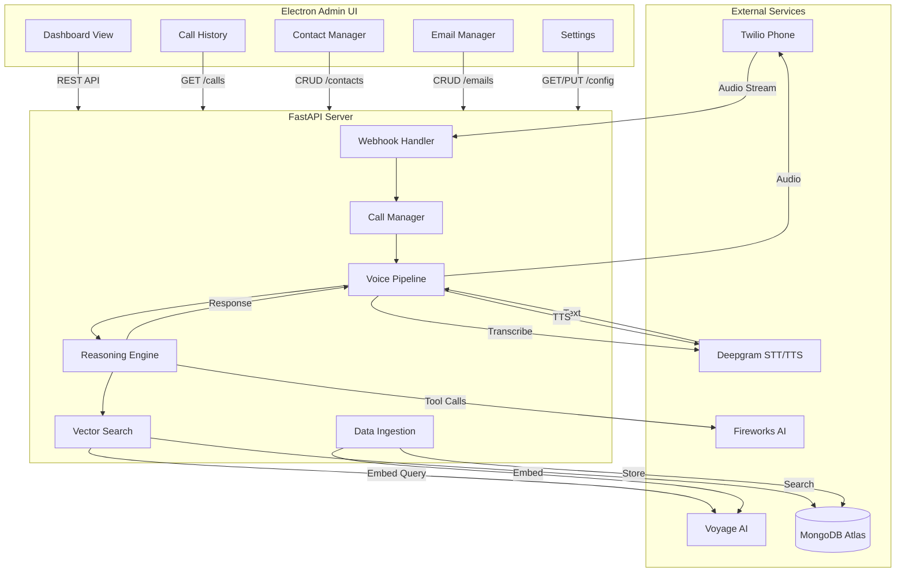

# Design Document: AI Receptionist

## Overview

The AI Receptionist is a context-aware voice assistant that performs adaptive retrieval to intelligently handle incoming phone calls. The system integrates multiple services: Twilio for telephony, Deepgram for voice processing, Fireworks AI for reasoning and tool calling, Voyage AI for embeddings, and MongoDB Atlas for vector storage.

The architecture follows a pipeline pattern where audio flows through transcription, reasoning, retrieval, and response generation stages. The system is designed for low latency to enable natural conversation flow.

## Architecture



## Components and Interfaces

### 1. Webhook Handler

Handles incoming Twilio webhooks for call events.

```python
class WebhookHandler:
    async def handle_incoming_call(self, request: TwilioRequest) -> TwiMLResponse:
        """Process incoming call webhook, return TwiML to start streaming."""
        pass
    
    async def handle_audio_stream(self, websocket: WebSocket) -> None:
        """Handle bidirectional audio streaming via WebSocket."""
        pass
    
    async def handle_call_status(self, request: CallStatusRequest) -> None:
        """Process call status updates (completed, failed, etc.)."""
        pass
```

### 2. Call Manager

Manages active call state and orchestrates the conversation flow.

```python
@dataclass
class CallState:
    call_sid: str
    caller_number: str
    transcript_history: list[str]
    context: dict
    status: CallStatus

class CallManager:
    def __init__(self):
        self.active_calls: dict[str, CallState] = {}
    
    async def start_call(self, call_sid: str, caller_number: str) -> CallState:
        """Initialize a new call session."""
        pass
    
    async def update_transcript(self, call_sid: str, text: str) -> None:
        """Add transcribed text to call history."""
        pass
    
    async def end_call(self, call_sid: str) -> None:
        """Clean up call session."""
        pass
```

### 3. Voice Pipeline

Handles speech-to-text and text-to-speech via Deepgram.

```python
class VoicePipeline:
    def __init__(self, deepgram_client: DeepgramClient):
        self.client = deepgram_client
    
    async def transcribe_stream(self, audio_stream: AsyncIterator[bytes]) -> AsyncIterator[str]:
        """Stream audio to Deepgram, yield transcribed text."""
        pass
    
    async def synthesize_speech(self, text: str) -> bytes:
        """Convert text to speech audio."""
        pass
    
    def get_greeting(self) -> str:
        """Return the initial greeting message."""
        return "Hello, this is the AI assistant. How may I help you today?"
```

### 4. Reasoning Engine

Uses Fireworks AI for tool calling decisions and response generation.

```python
class Tool(Enum):
    SEARCH_EMAILS = "search_emails"
    SEARCH_CONTACTS = "search_contacts"
    GENERATE_RESPONSE = "generate_response"

@dataclass
class ToolCall:
    tool: Tool
    arguments: dict

class ReasoningEngine:
    def __init__(self, fireworks_client: FireworksClient):
        self.client = fireworks_client
        self.model = "accounts/fireworks/models/firefunction-v2"
    
    async def decide_action(self, transcript: str, context: dict) -> list[ToolCall]:
        """Analyze transcript and decide which tools to invoke."""
        pass
    
    async def generate_response(self, transcript: str, context: dict) -> str:
        """Generate a contextual response based on gathered information."""
        pass
    
    def extract_caller_info(self, transcript: str) -> dict:
        """Extract caller name and purpose from transcript."""
        pass
```

### 5. Vector Search

Handles embedding generation and MongoDB Atlas vector search.

```python
@dataclass
class SearchResult:
    content: str
    metadata: dict
    score: float

class VectorSearch:
    def __init__(self, voyage_client: VoyageClient, mongo_client: MongoClient):
        self.voyage = voyage_client
        self.mongo = mongo_client
        self.db = mongo_client["receptionist"]
    
    async def embed_text(self, text: str) -> list[float]:
        """Generate embedding vector using Voyage AI."""
        pass
    
    async def search_emails(self, query: str, limit: int = 3) -> list[SearchResult]:
        """Search emails using vector similarity."""
        pass
    
    async def search_contacts(self, name: str) -> list[SearchResult]:
        """Search contacts by name."""
        pass
```

### 6. Data Ingestion

Handles ingesting emails and contacts into MongoDB with embeddings.

```python
@dataclass
class Email:
    id: str
    sender: str
    subject: str
    body: str
    timestamp: datetime
    embedding: list[float] | None = None

@dataclass
class Contact:
    id: str
    name: str
    email: str
    phone: str | None
    company: str | None

class DataIngestion:
    def __init__(self, vector_search: VectorSearch):
        self.vector_search = vector_search
    
    async def ingest_email(self, email: Email) -> None:
        """Generate embedding and store email in MongoDB."""
        pass
    
    async def ingest_contact(self, contact: Contact) -> None:
        """Store contact in MongoDB."""
        pass
    
    async def bulk_ingest_emails(self, emails: list[Email]) -> int:
        """Bulk ingest emails, return count of ingested records."""
        pass
```

## Data Models

### MongoDB Collections

#### emails Collection
```json
{
  "_id": "ObjectId",
  "sender": "string",
  "subject": "string", 
  "body": "string",
  "timestamp": "datetime",
  "embedding": "[float]"
}
```

Vector Search Index Configuration:
```json
{
  "name": "email_vector_index",
  "type": "vectorSearch",
  "definition": {
    "fields": [
      {
        "type": "vector",
        "path": "embedding",
        "numDimensions": 1024,
        "similarity": "cosine"
      }
    ]
  }
}
```

#### contacts Collection
```json
{
  "_id": "ObjectId",
  "name": "string",
  "email": "string",
  "phone": "string",
  "company": "string"
}
```

### API Request/Response Models

```python
class TwilioRequest(BaseModel):
    CallSid: str
    From: str
    To: str
    CallStatus: str

class TwiMLResponse:
    """TwiML XML response for Twilio."""
    pass

class CallStatusRequest(BaseModel):
    CallSid: str
    CallStatus: str
    CallDuration: int | None
```

### 7. Admin UI (Electron)

Desktop application for system management built with Electron + React.

```typescript
// Main Process
interface AdminApp {
  createWindow(): BrowserWindow;
  setupIPC(): void;
  connectToServer(baseUrl: string): Promise<boolean>;
}

// Renderer Process - API Client
interface ApiClient {
  baseUrl: string;
  
  // Call History
  getCallHistory(limit?: number): Promise<CallRecord[]>;
  getCallDetails(callSid: string): Promise<CallRecord>;
  
  // Contacts
  getContacts(): Promise<Contact[]>;
  createContact(contact: ContactInput): Promise<Contact>;
  updateContact(id: string, contact: ContactInput): Promise<Contact>;
  deleteContact(id: string): Promise<void>;
  
  // Emails
  getEmails(limit?: number): Promise<Email[]>;
  importEmails(emails: EmailInput[]): Promise<number>;
  deleteEmail(id: string): Promise<void>;
  
  // Config
  getConfig(): Promise<SystemConfig>;
  updateConfig(config: Partial<SystemConfig>): Promise<SystemConfig>;
}

// Data Types
interface CallRecord {
  callSid: string;
  callerNumber: string;
  identifiedName: string | null;
  callPurpose: string | null;
  outcome: 'connected' | 'voicemail' | 'rejected' | 'missed';
  timestamp: Date;
  duration: number;
  transcript: string[];
}

interface SystemConfig {
  twilioAccountSid: string;
  twilioAuthToken: string;
  deepgramApiKey: string;
  fireworksApiKey: string;
  voyageApiKey: string;
  mongodbUri: string;
  serverPort: number;
}
```

#### UI Components

```typescript
// Dashboard Component
const Dashboard: React.FC = () => {
  // Shows: recent calls, system status, quick stats
};

// Call History Component  
const CallHistory: React.FC = () => {
  // Table view of calls with filtering and search
};

// Contact Manager Component
const ContactManager: React.FC = () => {
  // CRUD interface for contacts with form validation
};

// Email Manager Component
const EmailManager: React.FC = () => {
  // List view of emails, import functionality
};

// Settings Component
const Settings: React.FC = () => {
  // API key configuration, connection settings
};
```

## Correctness Properties

*A property is a characteristic or behavior that should hold true across all valid executions of a system—essentially, a formal statement about what the system should do. Properties serve as the bridge between human-readable specifications and machine-verifiable correctness guarantees.*

### Property 1: Webhook Routing Correctness

*For any* valid Twilio webhook request containing a CallSid and caller number, the system should create a corresponding CallState and route the call to the Voice Pipeline.

**Validates: Requirements 1.1**

### Property 2: Caller Information Extraction

*For any* transcript containing a name pattern (e.g., "Hi, it's [Name]" or "This is [Name]") and a purpose phrase, the Reasoning Engine should extract both the caller name and call purpose as non-empty strings.

**Validates: Requirements 2.1**

### Property 3: Adaptive Retrieval Triggers

*For any* extracted caller information containing a name, a contact search should be triggered. *For any* extracted call purpose, an email search should be triggered. Both searches should be invoked when both pieces of information are present.

**Validates: Requirements 2.2, 2.3**

### Property 4: Context Synthesis Completeness

*For any* set of search results containing contact matches and email matches, the synthesized context should include information from both sources (contact name/details and email subject/content).

**Validates: Requirements 2.4**

### Property 5: Embedding Generation Consistency

*For any* non-empty text input, the Embedding Service should produce a vector of exactly 1024 dimensions (Voyage AI output size). The same text should always produce the same embedding vector.

**Validates: Requirements 3.1, 5.1**

### Property 6: Search Results Ordering

*For any* vector search query returning multiple results, the results should be sorted in descending order by relevance score (highest score first).

**Validates: Requirements 3.3**

### Property 7: Search Result Limiting

*For any* vector search query, the number of returned results should not exceed 3, regardless of how many matches exist in the database.

**Validates: Requirements 3.5**

### Property 8: Response References Context

*For any* generated response where context contains found email information, the response text should contain at least one reference to the email content (subject, sender, or key terms).

**Validates: Requirements 4.1**

### Property 9: TTS Audio Production

*For any* non-empty text response, the Voice Pipeline should produce non-empty audio bytes.

**Validates: Requirements 4.2**

### Property 10: Context Persistence Across Exchanges

*For any* sequence of transcript updates to a call session, the CallState transcript_history should contain all previous transcripts in order, and context should accumulate rather than reset.

**Validates: Requirements 4.5**

### Property 11: Data Ingestion Round-Trip

*For any* valid Email or Contact object that is ingested, querying the database by the object's ID should return an equivalent object with all original fields preserved.

**Validates: Requirements 5.2, 5.3**

### Property 12: Idempotent Ingestion

*For any* Email or Contact object, ingesting it twice should result in exactly one record in the database (update semantics, not duplicate creation).

**Validates: Requirements 5.5**

### Property 13: Tool Selection Correctness

*For any* transcript requiring information lookup, the Reasoning Engine should select the appropriate tool (search_emails for purpose queries, search_contacts for name queries). The tool selection should match the information need.

**Validates: Requirements 6.1, 6.2**

### Property 14: Sufficient Context Optimization

*For any* call state where context already contains matching contact and email information for the current query, the Reasoning Engine should generate a response without invoking additional search tools.

**Validates: Requirements 6.3**

### Property 15: Audio Stream Forwarding

*For any* audio bytes received on the WebSocket connection, the bytes should be forwarded to the Voice Pipeline for transcription without loss or corruption.

**Validates: Requirements 7.2**

### Property 16: Error Response Codes

*For any* webhook request that fails processing (invalid payload, internal error), the API Server should return an HTTP error status code (4xx or 5xx) rather than a success code.

**Validates: Requirements 7.5**

### Property 17: Admin UI Contact CRUD Round-Trip

*For any* valid Contact object created via the Admin UI, retrieving, updating, and deleting that contact should work correctly, and the contact list should reflect all changes.

**Validates: Requirements 8.3**

### Property 18: Admin UI Call History Completeness

*For any* completed call in the system, the Admin UI call history should display the caller number, identified name (if found), call purpose (if identified), and outcome.

**Validates: Requirements 8.2**

### Property 19: Admin UI Server Connection Resilience

*For any* API request when the server is unreachable, the Admin UI should display a connection error message and provide a retry option rather than crashing or hanging.

**Validates: Requirements 8.7**

## Error Handling

### Telephony Errors
- **Connection Failure**: Log error, attempt reconnection up to 3 times with exponential backoff
- **Audio Stream Interruption**: Gracefully handle disconnection, clean up CallState
- **Invalid Webhook Payload**: Return 400 Bad Request, log malformed data

### Voice Pipeline Errors
- **Transcription Failure**: Return empty transcript, log error, continue listening
- **TTS Failure**: Fall back to text response via Twilio Say verb
- **Deepgram API Timeout**: Retry once, then proceed without transcription

### Reasoning Engine Errors
- **Fireworks API Failure**: Return generic response, log error
- **Tool Execution Failure**: Skip failed tool, continue with available context
- **Invalid Tool Response**: Log and ignore, proceed with partial context

### Vector Search Errors
- **MongoDB Connection Failure**: Return empty results, log error
- **Voyage API Failure**: Return empty results, log error
- **Invalid Query**: Return empty results with warning log

### Data Ingestion Errors
- **Embedding Generation Failure**: Skip record, log error, continue batch
- **Database Write Failure**: Retry once, then skip record with error log
- **Duplicate Detection Failure**: Proceed with insert, handle duplicate key error

## Testing Strategy

### Unit Tests
Unit tests verify specific examples and edge cases:

- **Webhook Handler**: Test valid/invalid Twilio payloads, TwiML response generation
- **Call Manager**: Test call state lifecycle (create, update, end)
- **Voice Pipeline**: Test greeting message content, audio format validation
- **Reasoning Engine**: Test caller info extraction with various transcript formats
- **Vector Search**: Test query construction, result parsing
- **Data Ingestion**: Test email/contact model validation

### Property-Based Tests
Property tests verify universal properties across all inputs using **Hypothesis** (Python PBT library):

- Each property test runs minimum 100 iterations
- Tests are tagged with: **Feature: ai-receptionist, Property {N}: {property_text}**
- Generators create random but valid inputs (transcripts, emails, contacts)

**Property Test Coverage**:
| Property | Test Focus |
|----------|------------|
| 1 | Webhook routing with random valid payloads |
| 2 | Caller extraction with generated transcript patterns |
| 3 | Search trigger verification with random caller info |
| 5 | Embedding consistency with random text inputs |
| 6 | Result ordering with random score sets |
| 7 | Result limiting with varying result counts |
| 10 | Context persistence with random exchange sequences |
| 11 | Round-trip ingestion with random email/contact objects |
| 12 | Idempotent ingestion with duplicate submissions |
| 16 | Error responses with invalid payloads |

### Integration Tests
- End-to-end call flow with mocked Twilio
- Vector search with test MongoDB instance
- Full pipeline from webhook to response generation

### Test Configuration
```python
# pytest.ini
[pytest]
testpaths = tests
python_files = test_*.py
python_functions = test_*
addopts = -v --hypothesis-show-statistics
```
